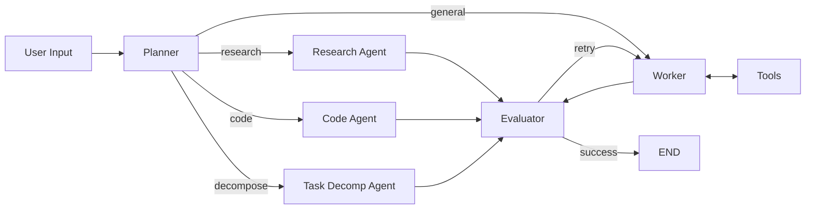

# LangGraph Personal Assistant - Learning Notes

Key learnings from building a multi-agent AI assistant with LangGraph.

---

## 1. State & Reducers

### State Definition
```python
class State(TypedDict):
    messages: Annotated[List[Any], add_messages]  # Conversation history
    success_criteria: str                          # What defines "done"
    feedback_on_work: Optional[str]               # Evaluator's feedback
    success_criteria_met: bool                    # Loop termination
    user_input_needed: bool                       # Pause for human
```

### The `add_messages` Reducer
```python
messages: Annotated[List[Any], add_messages]
```

**What it does:**
- Appends new messages (instead of replacing)
- Deduplicates by message ID
- Manages ordering

```python
# Without reducer: [msg1, msg2] + [msg3] = [msg3]  # REPLACED!
# With reducer:    [msg1, msg2] + [msg3] = [msg1, msg2, msg3]  # APPENDED
```

---

## 2. Architecture Patterns

### Pattern A: Simple Worker-Evaluator
```
User Input → Worker LLM → Tools → Evaluator → Success? → Done/Loop
```
Good for simple tasks. Single LLM does all work.

### Pattern B: Plan-Route-Execute-Evaluate (This Project)


**Why this pattern:**
- Planner loads memory → routes intelligently
- Specialized agents for domain tasks
- General worker for tool-heavy tasks
- Evaluator validates all outputs

### Key Insight
> Planner sees memory, so personal questions route to Worker (not Research).

---

## 3. Memory Systems

### Short-term Memory (Thread-scoped)
```python
# AsyncSqliteSaver stores checkpoints per thread_id
self.checkpointer = AsyncSqliteSaver(self.db_conn)
config = {"configurable": {"thread_id": thread_id}}
```

**Tables:** `checkpoints`, `writes`

### Long-term Memory (Cross-session)
```python
# Custom table for user facts
CREATE TABLE long_term_memory (
    id INTEGER PRIMARY KEY,
    user_id TEXT,
    fact TEXT NOT NULL,
    created_at TIMESTAMP
);
```

**Load in planner for routing decisions:**
```python
memories = await self.get_long_term_memories()
memory_context = "\n".join(f"- {m}" for m in memories)
```

### SQLite vs Redis
| Use Case | Choice |
|----------|--------|
| Single user, local | SQLite |
| Multi-instance, distributed | Redis |
| High throughput (>100 req/s) | Redis |

---

## 4. Clarifying Questions

Per [OpenAI Model Spec](https://model-spec.openai.com/2025-12-18.html):

- **Default: 0 questions** - proceed with stated assumptions
- **Ambiguous + high stakes: 1 question max**
- **Never ask trivial clarifying questions**

```python
# Implementation
if result.needs_clarification and clarification_count < 1:
    question = result.clarifying_questions[0]  # Only first
```

---

## 5. Monitoring & Observability

### Industry Status (2026)
- 89% of organizations have agent observability
- 62% have step-level tracing
- Observability > Evals adoption (52%)

### Metrics Implemented

| Metric | Location | Tracks |
|--------|----------|--------|
| `planner.routing` | Planner node | Which agent selected |
| `worker.tool_call` | Worker node | Each tool invocation |
| `worker.error` | Worker node | LLM failures |
| `worker.self_correction` | Worker node | Retry after rejection |
| `evaluator.result` | Evaluator node | Success/rejection |
| `request.latency` | Run method | End-to-end time |

### Implementation
```python
async def record_metric(self, name: str, value: float = 1.0,
                        metadata: dict = None, thread_id: str = None):
    await self.db_conn.execute(
        "INSERT INTO metrics (thread_id, metric_name, metric_value, metadata) VALUES (?, ?, ?, ?)",
        (thread_id or self.sidekick_id, name, value, json.dumps(metadata) if metadata else None)
    )
```

### Query Examples
```bash
# View all metrics
sqlite3 conversations.sqlite "SELECT * FROM metrics ORDER BY timestamp DESC LIMIT 20;"

# Average latency
sqlite3 conversations.sqlite "SELECT AVG(metric_value) FROM metrics WHERE metric_name='request.latency';"

# Self-correction rate
sqlite3 conversations.sqlite "
SELECT COUNT(*) as corrections,
       (SELECT COUNT(*) FROM metrics WHERE metric_name='evaluator.result'
        AND json_extract(metadata,'$.success')=1) as successes
FROM metrics WHERE metric_name='worker.self_correction';"

# Tool usage breakdown
sqlite3 conversations.sqlite "
SELECT json_extract(metadata,'$.tool') as tool, COUNT(*)
FROM metrics WHERE metric_name='worker.tool_call'
GROUP BY tool ORDER BY COUNT(*) DESC;"
```

### LangSmith Setup
```bash
# .env
LANGCHAIN_TRACING_V2=true
LANGCHAIN_API_KEY=lsv2_pt_xxxxx
LANGCHAIN_PROJECT=sidekick
```

### Observability Platforms
| Platform | Best For |
|----------|----------|
| LangSmith | LangChain/LangGraph users |
| Langfuse | Open-source, self-hosted |
| Braintrust | Production monitoring |
| Arize Phoenix | Enterprise ML |

---

## 6. Security Considerations

### Sandboxed Python REPL
```python
BLOCKED_PATTERNS = [
    r'\bos\.(system|popen|exec|spawn|remove|unlink)',
    r'\bsubprocess\b',
    r'\beval\s*\(',
    r'\bexec\s*\(',
    r'\bopen\s*\([^)]*["\'][wa]',  # Block write mode
    r'\bsocket\b',
]
```

### Key Rules
- Block dangerous operations via regex
- Use `headless=True` for Playwright in production
- Validate push notification responses
- Don't expose API keys in responses

---

## 7. Async Cleanup Pattern

```python
async def cleanup_async(self):
    """Properly await all cleanup tasks."""
    cleanup_tasks = []
    if self.browser:
        cleanup_tasks.append(self.browser.close())
    if self.playwright:
        cleanup_tasks.append(self.playwright.stop())
    if self.db_conn:
        cleanup_tasks.append(self.db_conn.close())

    if cleanup_tasks:
        await asyncio.gather(*cleanup_tasks, return_exceptions=True)

def cleanup(self):
    """Handle both async and sync contexts."""
    try:
        asyncio.get_running_loop()
        asyncio.ensure_future(self.cleanup_async())
    except RuntimeError:
        asyncio.run(self.cleanup_async())
```

---

## 8. Useful SQLite Commands

```bash
# View all tables
sqlite3 conversations.sqlite ".tables"

# View long-term memories
sqlite3 conversations.sqlite "SELECT * FROM long_term_memory;"

# Count checkpoints per thread
sqlite3 conversations.sqlite "SELECT thread_id, COUNT(*) FROM checkpoints GROUP BY thread_id;"

# Export metrics to CSV
sqlite3 -header -csv conversations.sqlite "SELECT * FROM metrics;" > metrics.csv

# Interactive mode
sqlite3 conversations.sqlite
> .mode column
> .headers on
> SELECT * FROM metrics LIMIT 10;
```

---

## 9. SQLite Database Files

### File Structure
| File | Purpose |
|------|---------|
| `conversations.sqlite` | Main database file |
| `conversations.sqlite-shm` | Shared memory (WAL mode) |
| `conversations.sqlite-wal` | Write-ahead log |

### Tables
| Table | Purpose |
|-------|---------|
| `checkpoints` | LangGraph state snapshots (per thread_id) |
| `writes` | Incremental state changes |
| `long_term_memory` | User facts across sessions |
| `metrics` | Agent performance metrics |

### WAL Mode (Write-Ahead Logging)
SQLite uses WAL mode for better concurrency:
- `-shm` = Memory-mapped file for faster access
- `-wal` = Pending writes before commit to main db

**Benefits:**
- Multiple readers + one writer simultaneously
- Faster writes (append-only)
- Crash recovery

**Important:**
- Don't delete `-shm` or `-wal` while app is running → data loss
- Backup all 3 files together
- Large `-wal` = many uncommitted writes (normal during active use)

**Force checkpoint (merge WAL into main db):**
```bash
sqlite3 conversations.sqlite "PRAGMA wal_checkpoint(TRUNCATE);"
```

---

## 10. Key Dependencies

| Package | Purpose |
|---------|---------|
| `langgraph` | StateGraph, ToolNode, checkpointers |
| `langchain-openai` | ChatOpenAI |
| `langchain-core` | Messages (System, Human, AI) |
| `langchain-community` | Toolkits (File, Playwright, Serper) |
| `aiosqlite` | Async SQLite |
| `pydantic` | Structured outputs |
| `gradio` | Web UI |

---

## 11. References

- [LangGraph Documentation](https://langchain-ai.github.io/langgraph/)
- [LangSmith Observability](https://www.langchain.com/langsmith/observability)
- [OpenAI Model Spec - Clarifying Questions](https://model-spec.openai.com/2025-12-18.html)
- [GPT-5.2 Prompting Guide](https://cookbook.openai.com/examples/gpt-5/gpt-5-2_prompting_guide)
- [LangChain State of Agent Engineering](https://www.langchain.com/state-of-agent-engineering)
- [LLM Evaluation Metrics - Confident AI](https://www.confident-ai.com/blog/llm-evaluation-metrics-everything-you-need-for-llm-evaluation)
- [OpenTelemetry AI Agent Observability](https://opentelemetry.io/blog/2025/ai-agent-observability/)
